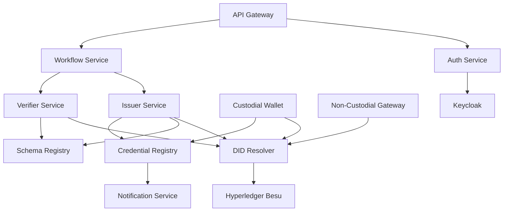

# EmploymentVC - Architecture Alignment Plan

**Date**: February 10, 2026  
**Purpose**: Align codebase with Enterprise-Grade SSI Microservice Architecture

---

## 🎯 **Target Architecture**

### **Core Principles**
- ✅ Microservice-oriented
- ✅ Zero-trust security model
- ✅ Event-driven where applicable
- ✅ Policy-enforced (OPA)
- ✅ Observability-first
- ✅ Cloud-agnostic (Kubernetes-native)
- ✅ One service = one deployable container
- ✅ Shared logic ONLY via backend-libraries
- ✅ No cross-service database access

---

## 📋 **Service Mapping**

### **✅ Existing Services (Keep & Enhance)**

| Current Service | Target Service | Status | Actions Required |
|----------------|----------------|--------|------------------|
| `api-gateway` | API Gateway | ✅ Keep | Add observability, policies |
| `auth-service` | Auth Service (OIDC + DIDAuth) | ✅ Keep | Enhance with DIDAuth, Keycloak bridge |
| `did-registry` | DID Registry/Resolver Service | ✅ Keep | Add resolver capabilities |
| `issuer-api` | Issuer Service | ✅ Keep | Standardize to OpenAPI contract |
| `verifier-api` | Verifier Service | ✅ Keep | Standardize to OpenAPI contract |
| `schema-registry` | Schema Registry (JSON-LD) | ✅ Keep | Enhance JSON-LD support |

### **🔄 Services to Refactor**

| Current Service | Target Services | Actions |
|----------------|----------------|---------|
| `wallet-api` | → Custodial Wallet Service<br>→ Non-Custodial Wallet Gateway | **Split into two services**:<br>1. Custodial wallet (platform-managed keys)<br>2. Non-custodial gateway (external wallets) |
| `web3-login-service` | → Auth Service | **Merge into auth-service**<br>Web3 auth is a capability, not a separate service |

### **➕ New Services to Create**

| Service Name | Purpose | Priority |
|-------------|---------|----------|
| **Workflow Service** | Employment lifecycle orchestration | 🔴 Critical |
| **Credential Registry & Revocation Service** | Track issued credentials, manage revocation | 🔴 Critical |
| **Notification Service** | Async notifications (email, push, webhooks) | 🟡 Medium |

### **🗑️ Services to Remove/Archive**

| Service | Action | Reason |
|---------|--------|--------|
| `e2e-test-service` | Move to `/tests` directory | Not a runtime service |

---

## 📁 **Updated Repository Structure**

### **Target Structure**
```
EmploymentVC/
├── backend-services/          # Microservices (one per container)
│   ├── api-gateway/
│   ├── auth-service/          # OIDC + DIDAuth + Keycloak bridge
│   ├── workflow-service/      # NEW: Employment lifecycle
│   ├── issuer-service/        # Renamed from issuer-api
│   ├── verifier-service/      # Renamed from verifier-api
│   ├── did-resolver-service/  # Renamed from did-registry
│   ├── schema-registry/
│   ├── credential-registry/   # NEW: Credential tracking + revocation
│   ├── custodial-wallet/      # NEW: Split from wallet-api
│   ├── noncustodial-gateway/  # NEW: Split from wallet-api
│   └── notification-service/  # NEW: Async notifications
│
├── backend-libraries/         # Shared logic (no direct deployment)
│   ├── auth-lib/
│   ├── credentials-lib/
│   ├── crypto-lib/
│   ├── protocols-lib/
│   ├── sdjwts-lib/
│   ├── core-wallet-lib/
│   ├── utils-lib/
│   ├── did-lib/
│   ├── library-commons/
│   └── openid4vc-lib/
│
├── frontend/                  # Consolidated frontend (Next.js)
│   ├── employer-portal/       # NEW: Issuer + Verifier combined
│   ├── employee-portal/       # NEW: Holder wallet
│   └── shared/                # Shared components, types
│
├── infra/                     # Infrastructure as Code
│   ├── kubernetes/            # K8s manifests
│   ├── docker/                # Dockerfiles
│   ├── terraform/             # Cloud provisioning
│   ├── besu/                  # Hyperledger Besu config
│   └── keycloak/              # Keycloak config
│
├── security/                  # NEW: Security artifacts
│   ├── opa-policies/          # Policy-as-code
│   ├── vault-config/          # HashiCorp Vault
│   └── certificates/          # TLS/mTLS certs
│
├── observability/             # NEW: Observability stack
│   ├── prometheus/            # Metrics config
│   ├── grafana/               # Dashboards
│   ├── loki/                  # Log aggregation
│   └── tempo/                 # Distributed tracing
│
├── tests/                     # NEW: All testing
│   ├── e2e/                   # End-to-end tests
│   ├── integration/           # Integration tests
│   └── performance/           # Load/performance tests
│
├── docs/                      # Documentation
│   ├── architecture/          # Architecture docs
│   ├── api/                   # API specs (OpenAPI)
│   ├── security/              # Security documentation
│   └── guides/                # Developer guides
│
├── scripts/                   # Automation scripts
│   ├── build/
│   ├── deploy/
│   └── dev-setup/
│
└── shared/                    # Cross-cutting concerns
    ├── contracts/             # OpenAPI specs
    ├── schemas/               # JSON-LD schemas
    └── events/                # Event schemas
```

---

## 🔧 **Implementation Plan**

### **Phase 1: Foundation (Immediate)**
1. ✅ Create architecture alignment documentation
2. ⬜ Create new directory structure
3. ⬜ Create missing services (boilerplate)
4. ⬜ Split wallet-api into custodial-wallet + noncustodial-gateway
5. ⬜ Merge web3-login-service into auth-service
6. ⬜ Move e2e-test-service to tests/e2e
7. ⬜ Update settings.gradle with new modules

### **Phase 2: Security & Observability**
8. ⬜ Create security/ directory structure
9. ⬜ Add OPA policy templates
10. ⬜ Create observability/ directory structure
11. ⬜ Add Prometheus/Grafana/Loki/Tempo configs
12. ⬜ Add health check endpoints to all services

### **Phase 3: Frontend Reorganization**
13. ⬜ Create frontend/ directory
14. ⬜ Create employer-portal (Next.js)
15. ⬜ Create employee-portal (Next.js)
16. ⬜ Migrate existing React Native to employee-portal/mobile

### **Phase 4: Service Contracts**
17. ⬜ Create OpenAPI specs for all services
18. ⬜ Add contract-first code generation
19. ⬜ Update service implementations to match contracts

### **Phase 5: Infrastructure**
20. ⬜ Update Kubernetes manifests for all services
21. ⬜ Create Dockerfiles for new services
22. ⬜ Update docker-compose.yml
23. ⬜ Add Terraform configurations (optional)

### **Phase 6: Documentation**
24. ⬜ Update ARCHITECTURE.md
25. ⬜ Create service-specific README.md files
26. ⬜ Create API documentation
27. ⬜ Update deployment guides

---

## 🚨 **Critical Engineering Rules**

### **Service Design**
- ✅ Each service has own database (no shared DB)
- ✅ Stateless services (state in DB/cache only)
- ✅ REST APIs with OpenAPI specs
- ✅ gRPC for service-to-service (optional)
- ✅ Event-driven for async workflows

### **Security**
- ✅ Zero-trust networking (mTLS)
- ✅ Secrets in Vault (never in code/env)
- ✅ OPA for policy enforcement
- ✅ Fail closed, not open
- ✅ Explicit trust boundaries

### **Observability**
- ✅ Structured logging (JSON)
- ✅ Prometheus metrics (/metrics endpoint)
- ✅ Distributed tracing (OpenTelemetry)
- ✅ Health checks (/health, /ready)
- ✅ Log correlation IDs

### **DevOps**
- ✅ Containerized (Docker)
- ✅ Kubernetes-ready (probes, resources)
- ✅ CI/CD compatible
- ✅ Environment-based config
- ✅ SBOM generation
- ✅ SAST/SCA scanning

---

## 📊 **Service Dependencies**



---

## 📝 **Next Steps**

1. **Review & Approve**: Confirm architecture alignment
2. **Execute Phase 1**: Create foundation structure
3. **Incremental Migration**: Migrate services one-by-one
4. **Testing**: Add tests at each phase
5. **Documentation**: Update docs continuously

---

## 📞 **Clarifications Needed**

Before proceeding with implementation, please confirm:

1. **Frontend Framework**: Proceed with Next.js for both portals?
2. **Event Bus**: Which event bus? (RabbitMQ, Kafka, NATS, Azure Service Bus)
3. **Vault**: Use HashiCorp Vault or cloud provider secrets?
4. **gRPC**: Use gRPC for service-to-service or stick with REST?
5. **Notification Channels**: Which channels? (Email, SMS, Push, Webhooks)
6. **Database per Service**: Separate Postgres instances or shared Postgres with separate schemas?

---

**Status**: ✅ Ready for review and implementation
