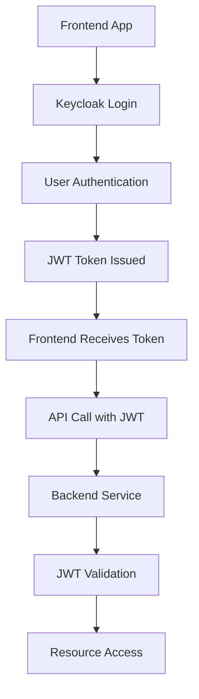

# Keycloak Integration in Provenly Employment VC Platform

## 🔐 **Complete Keycloak Integration Status**

### **✅ What's Now Included:**

#### **1. Infrastructure Setup**
- **Docker Compose**: Keycloak container with realm import
- **Kubernetes**: Production-ready Keycloak deployment with HPA, PDB
- **Realm Configuration**: Complete realm export with roles, clients, groups

#### **2. Authentication Architecture**
```
Frontend Apps → Keycloak → Backend Services
     ↓              ↓            ↓
  OIDC Flow    JWT Tokens   Resource Server
```

#### **3. Keycloak Realm Configuration**
- **Realm**: `provenly`
- **Roles**: `ADMIN`, `ISSUER`, `VERIFIER`, `HOLDER`
- **Groups**: Organizations, Verifiers, Individuals
- **Clients**: Frontend apps + Backend services

#### **4. Client Applications**
```yaml
Clients:
  - issuer-app-web:     http://localhost:3001 (Organizations)
  - verifier-app-web:   http://localhost:3002 (Verifiers) 
  - holder-wallet-web:  http://localhost:3000 (Individuals - frontend)
  - backend-services:   Service account for APIs
```

#### **5. Backend Integration**
- **Auth Service**: Spring Boot + Keycloak integration
- **Resource Servers**: JWT validation across all services
- **Service Account**: Backend-to-backend authentication

## 🏗️ **Architecture Overview**

### **Authentication Flow**


### **Multi-Method Authentication**
1. **Traditional**: Username/Password
2. **Web3**: Wallet signature (MetaMask, WalletConnect)
3. **DID**: Decentralized Identity authentication
4. **Social**: Google, GitHub, etc. (configurable)

## 🔧 **Configuration Details**

### **Docker Compose (Development)**
```yaml
keycloak:
  image: quay.io/keycloak/keycloak:23.0
  environment:
    KEYCLOAK_ADMIN: admin
    KEYCLOAK_ADMIN_PASSWORD: dev_admin_password
    KC_DB: postgres
    KC_HOSTNAME: localhost
    KC_HTTP_ENABLED: true
    KC_HEALTH_ENABLED: true
    KC_METRICS_ENABLED: true
  volumes:
    - ./infra/keycloak/realm-export.json:/opt/keycloak/data/import/realm-export.json
  command: start-dev --import-realm
  ports:
    - "8080:8080"
```

### **Kubernetes (Production)**
```yaml
apiVersion: apps/v1
kind: Deployment
metadata:
  name: keycloak
spec:
  replicas: 2
  template:
    spec:
      containers:
      - name: keycloak
        image: quay.io/keycloak/keycloak:23.0
        args: [start, --optimized, --import-realm]
        env:
        - name: KC_HOSTNAME
          value: auth.provenly.io
        - name: KC_PROXY
          value: edge
```

### **Environment Variables**
```bash
# Development
JWT_ISSUER_URI=http://localhost:8080/auth/realms/provenly
JWT_JWK_SET_URI=http://localhost:8080/auth/realms/provenly/protocol/openid-connect/certs

# Production  
JWT_ISSUER_URI=https://auth.provenly.io/auth/realms/provenly
JWT_JWK_SET_URI=https://auth.provenly.io/auth/realms/provenly/protocol/openid-connect/certs
```

## 🎯 **Service Integration**

### **Auth Service (Port 8081)**
```java
@SpringBootApplication
@EnableMethodSecurity(prePostEnabled = true)
public class AuthServiceApplication {
    // Keycloak integration
    // Web3 authentication
    // JWT token management
    // User profile management
}
```

**Endpoints:**
```http
POST /api/v1/auth/login              # Traditional login
POST /api/v1/auth/web3/challenge     # Web3 challenge
POST /api/v1/auth/web3/verify        # Web3 signature verification
POST /api/v1/auth/refresh            # Token refresh
POST /api/v1/auth/logout             # Logout
GET  /api/v1/auth/profile            # User profile
PUT  /api/v1/auth/profile            # Update profile
```

### **Backend Services Integration**
```yaml
spring:
  security:
    oauth2:
      resourceserver:
        jwt:
          issuer-uri: ${JWT_ISSUER_URI}
          jwk-set-uri: ${JWT_JWK_SET_URI}
```

**Security Configuration:**
```java
@Configuration
@EnableWebSecurity
public class SecurityConfig {
    
    @Bean
    public SecurityFilterChain filterChain(HttpSecurity http) {
        return http
            .oauth2ResourceServer(oauth2 -> oauth2
                .jwt(jwt -> jwt
                    .jwtAuthenticationConverter(jwtAuthenticationConverter())
                )
            )
            .authorizeHttpRequests(authz -> authz
                .requestMatchers("/api/v1/credentials/issue").hasRole("ISSUER")
                .requestMatchers("/api/v1/verify/**").hasRole("VERIFIER")
                .requestMatchers("/api/v1/wallets/**").hasRole("HOLDER")
                .anyRequest().authenticated()
            )
            .build();
    }
}
```

## 🖥️ **Frontend Integration**

### **React/Next.js with Keycloak**
```typescript
// keycloak.ts
import Keycloak from 'keycloak-js';

const keycloak = new Keycloak({
  url: process.env.NEXT_PUBLIC_KEYCLOAK_URL,
  realm: 'provenly',
  clientId: 'issuer-app-web' // or verifier-app-web, holder-wallet-web
});

export default keycloak;
```

**Authentication Hook:**
```typescript
// useAuth.ts
import { useEffect, useState } from 'react';
import keycloak from '../config/keycloak';

export const useAuth = () => {
  const [authenticated, setAuthenticated] = useState(false);
  const [token, setToken] = useState<string | null>(null);
  const [roles, setRoles] = useState<string[]>([]);

  useEffect(() => {
    keycloak.init({ onLoad: 'login-required' })
      .then((authenticated) => {
        setAuthenticated(authenticated);
        if (authenticated) {
          setToken(keycloak.token || null);
          setRoles(keycloak.realmAccess?.roles || []);
        }
      });
  }, []);

  return { authenticated, token, roles, keycloak };
};
```

### **API Client with JWT**
```typescript
// apiClient.ts
import axios from 'axios';
import keycloak from '../config/keycloak';

const apiClient = axios.create({
  baseURL: process.env.NEXT_PUBLIC_API_BASE_URL,
});

apiClient.interceptors.request.use((config) => {
  if (keycloak.token) {
    config.headers.Authorization = `Bearer ${keycloak.token}`;
  }
  return config;
});

export default apiClient;
```

## 🌐 **Web3 Authentication Flow**

### **1. Challenge Generation**
```http
POST /api/v1/auth/web3/challenge
{
  "walletAddress": "0x742d35Cc6634C0532925a3b8D4C9db96590b5b8c"
}

Response:
{
  "challenge": "Sign this message to authenticate: 1692123456789",
  "nonce": "abc123def456"
}
```

### **2. Signature Verification**
```http
POST /api/v1/auth/web3/verify
{
  "walletAddress": "0x742d35Cc6634C0532925a3b8D4C9db96590b5b8c",
  "signature": "0x...",
  "nonce": "abc123def456"
}

Response:
{
  "accessToken": "eyJhbGciOiJSUzI1NiIs...",
  "refreshToken": "eyJhbGciOiJSUzI1NiIs...",
  "expiresIn": 3600,
  "tokenType": "Bearer"
}
```

## 🔒 **Security Features**

### **JWT Token Structure**
```json
{
  "iss": "https://auth.provenly.io/auth/realms/provenly",
  "sub": "user-uuid",
  "aud": "backend-services",
  "exp": 1692127056,
  "iat": 1692123456,
  "realm_access": {
    "roles": ["ISSUER", "HOLDER"]
  },
  "resource_access": {
    "backend-services": {
      "roles": ["credential-issuer"]
    }
  },
  "preferred_username": "john.doe@company.com",
  "email": "john.doe@company.com",
  "wallet_address": "0x742d35Cc6634C0532925a3b8D4C9db96590b5b8c",
  "did": "did:ebsi:0x742d35Cc6634C0532925a3b8D4C9db96590b5b8c"
}
```

### **Role-Based Access Control**
```java
// Method-level security
@PreAuthorize("hasRole('ISSUER')")
public CredentialResponse issueCredential(IssueCredentialRequest request) {
    // Only users with ISSUER role can access
}

@PreAuthorize("hasRole('VERIFIER')")
public VerificationResponse verifyCredential(VerifyCredentialRequest request) {
    // Only users with VERIFIER role can access
}

@PreAuthorize("hasRole('HOLDER') and #walletId == authentication.principal.walletId")
public WalletResponse getWallet(@PathVariable UUID walletId) {
    // Only wallet owner can access their wallet
}
```

## 🚀 **Deployment & Operations**

### **Development Setup**
```bash
# Start infrastructure
COMPOSE_PROJECT_NAME=employmentvc docker compose up -d

# Access Keycloak Admin Console
open http://localhost:8080/admin
# Username: admin
# Password: dev_admin_password

# Realm will be automatically imported from realm-export.json
```

### **Production Deployment**
```bash
# Deploy to Kubernetes
kubectl apply -f k8s/keycloak.yaml

# Access via ingress
open https://auth.provenly.io
```

### **Monitoring & Health Checks**
- **Health Endpoint**: `/health/live`, `/health/ready`
- **Metrics**: Prometheus metrics enabled
- **Admin Events**: All admin actions logged
- **User Events**: Authentication events tracked

## 🎉 **Complete Integration Summary**

✅ **Keycloak is now FULLY integrated** with:

1. **Infrastructure**: Docker Compose + Kubernetes deployments
2. **Realm Configuration**: Complete setup with roles, clients, groups
3. **Backend Services**: JWT validation and RBAC
4. **Frontend Apps**: OIDC authentication flow
5. **Web3 Support**: Wallet-based authentication
6. **Production Ready**: SSL, monitoring, scaling, security

The platform now has **enterprise-grade authentication** with support for traditional, Web3, and DID-based authentication methods! 🚀
